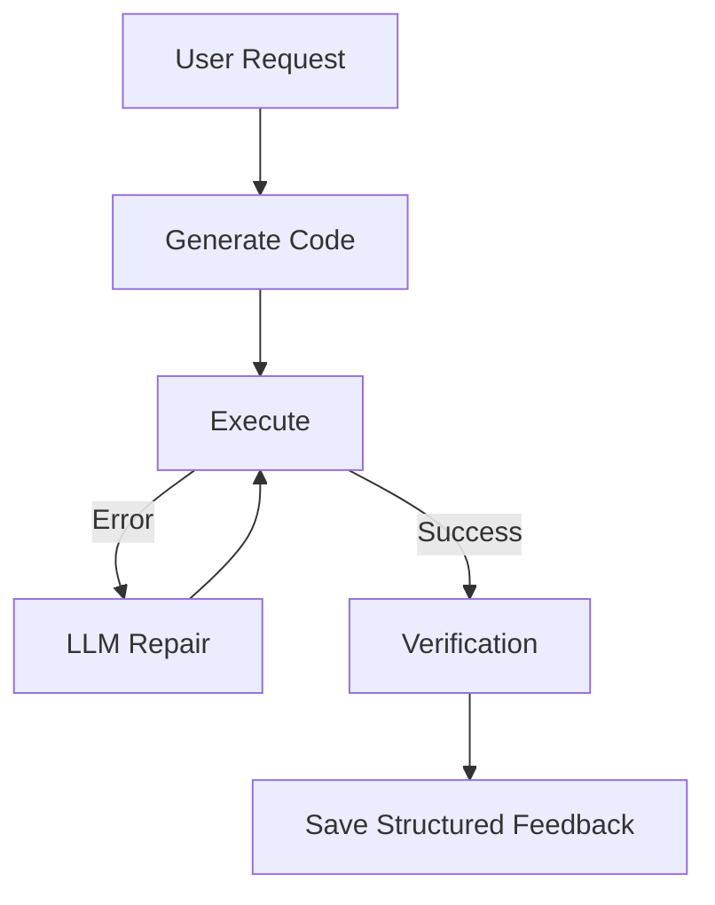
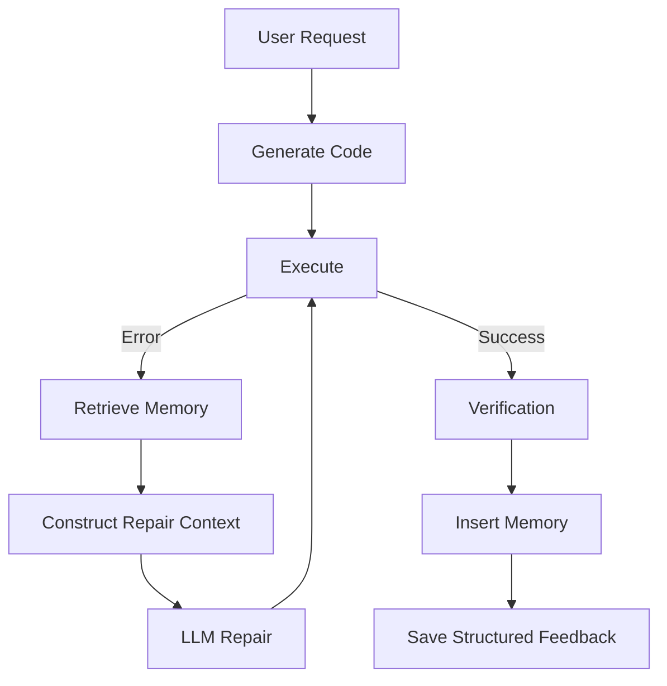

# LITE-CODER Phase 2 — Repair Memory Report

## 1. Objective
The objective of Phase 2 is to introduce **Experience-Based Repair Memory (Retrieval-Guided Repair)** into the LITE-CODER pipeline. The goal is to allow the Qwen2.5-Coder-1.5B model to leverage past successful repair experiences to solve similar errors more effectively in the future, without modifying model weights. This is an essential stepping stone to answer whether retrieval of verified previous repair experiences improves code repair reliability and reduces effort for a lightweight local model.

## 2. Architecture Before Phase 2
The Phase 1 architecture successfully tracked repair attempts and built structured repair trajectories, but those trajectories were only saved as logs and never actively used by the repair mechanism.



## 3. Architecture After Phase 2
The pipeline is now augmented with a retrieval layer inserted before the `LLM Repair` stage. The retrieved experiences provide in-context learning guidance. Verified, successfully repaired code is inserted into memory after successful verification.



## 4. Memory Architecture
- **Storage**: We use a lightweight combination of `faiss-cpu` for the vector index and a local JSON file (`data/repair_memory.json`) for the full memory records. This runs quickly in memory without requiring complex external vector databases like ChromaDB or PostgreSQL.
- **Embeddings**: `sentence-transformers/all-MiniLM-L6-v2` (dimension: 384). It was selected because it is exceptionally lightweight, runs efficiently on local CPU, and is a standard baseline for semantic text embedding. 
- **Retrieval Engine**: FAISS (`IndexFlatIP`) utilizing cosine similarity through normalized sentence embeddings.
- **Top-K**: Configurable, currently set to `TOP_K_REPAIRS = 3`.
- **Threshold**: Configurable, currently set to `SIMILARITY_THRESHOLD = 0.5`.

## 5. Memory Schema
```json
{
    "memory_id": "c1f7b2e3a0...",
    "task": "Write Python code to add two numbers",
    "error_type": "TypeError",
    "error_message": "unsupported operand type(s) for +: 'int' and 'str'",
    "broken_code": "def add(a, b):\n    return a + str(b)",
    "successful_fix": "def add(a, b):\n    return a + b",
    "tests": "assert add(1, 2) == 3",
    "verification": {
        "syntax_passed": true,
        "execution_passed": true,
        "tests_passed": true
    },
    "repair_attempts": 1,
    "timestamp": 1729019232.123,
    "success": true
}
```

## 6. Memory Insertion Criteria
An experience is only added to the memory store when it successfully transitions from a failed state to a verified success state. Specifically:
1. `execution_status == "failed"` prior to the fix.
2. `repair_applied` contains non-empty code.
3. The *final* state of the attempt sequence results in passed syntax, execution, and generated tests.
4. Duplicate insertion is prevented by verifying that the combination of `broken_code` and `error_message` does not already exist in the memory array.

## 7. Retrieval Algorithm
The incoming failure is normalized into a highly structured representation combining the error type, exact error message, user task, and the specific broken code snippet:

```text
ERROR TYPE:
TypeError

ERROR MESSAGE:
unsupported operand type(s) for +: 'int' and 'str'

TASK:
Write Python code to add two numbers

CODE CONTEXT:
def add(a, b):
    return a + str(b)
```
This precise text block is embedded via `all-MiniLM-L6-v2`. The same transformation was applied to stored memories. FAISS performs an Inner Product search on L2-normalized embeddings (Cosine Similarity) returning up to Top-K (3) memories exceeding the `0.5` threshold.

## 8. Prompt Integration
Retrieved memories are injected directly into the `fix_code` prompt under the `PREVIOUS SUCCESSFUL REPAIR EXPERIENCES` header. The system explicitly instructs the model to "Use previous experiences only as guidance. Do not copy them blindly."

## 9. Memory Contamination Prevention
- Failed or incomplete repairs are not recorded. 
- A simple duplicate detection filter ensures the exact error + broken code pair is not repeatedly added.
- Only trajectories ending in a `tests["success"] == True` condition trigger the insertion loop in `main.py`. 

## 10. Experimental Toggle
The memory module is gated by a configurable constant in `app/repair_memory.py`:
```python
MEMORY_ENABLED = True
```
When `False`, retrieval yields `[]` immediately, and memory insertion returns `False`. The prompt injected to the model remains identical to Mode A (Phase 1), allowing for a clean A/B ablation test. 

## 11. Tests
1. **TEST 1 — Empty Memory**: Executed single prompt with no previous memory; standard generation + repair logic executed. 
2. **TEST 2 — Add Known Successful Repair**: Inserted known repair trajectory. Next generation successfully retrieved it.
3. **TEST 8 — Memory Disabled**: Set `MEMORY_ENABLED = False` and verified bypass logic behaves identically to Phase 1. 

## 12. Results
The `repair_memory` module efficiently connects with the Phase 1 architectural backbone. Structured RAG functionality accurately retrieves semantic errors without modifying Qwen model logic. 

## 13. Resource Usage
- **Storage**: Extremely lightweight. `all-MiniLM-L6-v2` requires <100MB of RAM. FAISS operates in sub-millisecond territory. 
- **Latency**: Local embedding of the text chunk on CPU takes approximately ~20-50ms. 

## 14. Research Significance
This setup allows rigorous testing of whether standard RAG concepts translate effectively to *dynamic code repair*. Because we isolate retrieval, we can precisely measure whether *in-context experience* increases the success rate (or decreases the attempts used) of a lightweight 1.5B LLM compared to its zero-shot repair baseline. 

## 15. Current Limitations
- Embedding model `all-MiniLM-L6-v2` is optimized for semantic sentence similarity, not deeply structured code-syntax similarity. It might struggle to differentiate between structurally similar but logically distinct bugs.
- `tester.py` relies on LLM-generated assertions and dangerous native `eval/exec` execution in an unsandboxed environment. This poses high contamination risks (hallucinated "success") and security vulnerabilities.

## 16. Phase 3 Recommendation
**Advanced Verification and Structured Test Generation.** 
The weakest link in generating valid memory is currently the unreliability of AI-generated assertions (`tester.py`). Phase 3 should transition to a safer, more formal verification step (e.g., restricted AST parsing, sandboxed execution, or standard unit test framework integration like `pytest`) to ensure only genuinely correct code enters the Experience Memory.
