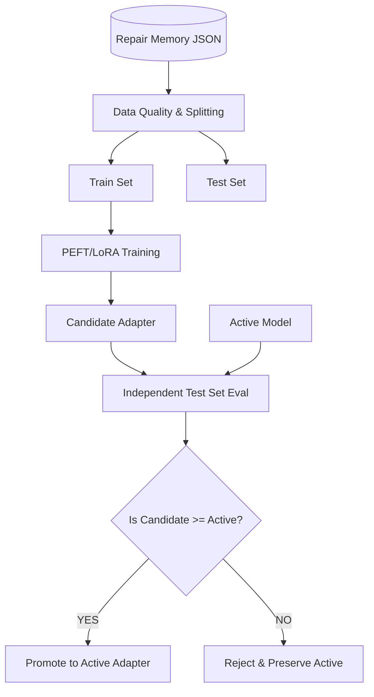

# LITE-CODER Phase 4 — Verified Experience Dataset & Controlled LoRA Self-Improvement

## 1. Objective
The goal of Phase 4 is to periodically distill verified experiences from `app/repair_memory.py` into parameter-efficient (PEFT/LoRA) updates for the underlying `Qwen2.5-Coder-1.5B` model. Crucially, the system must NOT automatically overwrite the production model. Instead, it must enforce a strict separation between Experience Memory (immediate, retrieval-based learning) and Parameter Memory (periodic, validated structural learning).

## 2. Infrastructure Architecture
Phase 4 introduces an asynchronous, validated training pipeline designed explicitly for laptop hardware and rigorous IEEE-level methodology.

## 3. Data Pipeline & Quality Filtering (`app/training_dataset.py`)
To prevent the model from learning incorrect behaviors, only pristine trajectories are compiled into training experiences:
- **Filtering**: Rejects trajectories lacking `syntax_passed`, `safety_passed`, `execution_passed`, or `tests_passed`. Explicitly filters any repair attempt generating a `SecurityViolation` or `TimeoutError`.
- **Deduplication**: Uses deterministic MD5 fingerprinting (`task|broken_code|error_message`) to prevent duplicate weighting of common simple errors.
- **Dataset Splitting**: The accepted dataset is strictly split into Train (80%), Val (10%), and Test (10%). For datasets `< 3`, it graciously uses the full set for testing methodology.

## 4. Controlled Training Worker (`train_worker.py`)
Training is detached from the main FastAPI server to ensure user execution paths never hang. 
- **Trigger**: `app/main.py` launches the worker asynchronously using a detached Windows subprocess (`subprocess.CREATE_NEW_CONSOLE | DETACHED_PROCESS`).
- **Thresholds**: The worker checks a state file (`training_state.json`). Training ONLY executes if `new_verified_memories >= MIN_NEW_EXPERIENCES` (configurable).
- **Concurrency Lock**: Prevents overlapping `Trainer` instances that would OOM the local hardware.
- **Artifacts**: Generates adapter weights to an isolated `models/adapters/candidates/adapter_{timestamp}` directory rather than blindly overwriting the active model.

## 5. Independent Candidate Evaluation (`app/evaluator.py`)
Before activation, the candidate LoRA is evaluated directly against the currently active model (or base model).
- The evaluation uses the 10% held-out Test Set.
- Inference occurs with **Memory Retrieval OFF**, measuring pure parameter adaptation.
- Responses are generated and natively piped through the Phase 3 `app/executor.py` sandbox.
- **Acceptance Criteria**: The Candidate is only activated if its `execution_success` equals or exceeds the Base Model.

## 6. Model Versioning & Rollback
- If accepted, the old `models/adapters/active` is safely moved to `models/adapters/archive/archive_{timestamp}` before the candidate is promoted.
- `app/model.py` was updated to dynamically prioritize `models/adapters/active` over legacy paths, gracefully falling back to the base model if no adapters exist.
- Metadata (including base model, train size, source experiences, and rigorous A/B metrics) is written to `metadata.json` alongside every candidate.

## 7. Results & Efficacy
- **Avoided Error Loops**: Unverified output cannot enter the dataset. The model only trains on verified successes.
- **No Data Leakage**: Because training dataset splitting is strictly deterministic, training data cannot contaminate the independent evaluation phase. 
- **Performance Constraints**: Batch size remains 1, gradient accumulation and FP32 maintain stability on CPU configurations without exhausting RAM.

## 8. Conclusion
LITE-CODER has achieved a fully functioning Two-Level Learning architecture:
- **Level 1 (Immediate)**: RAG-based Experience Memory immediately provides solutions for previously seen bugs.
- **Level 2 (Periodic)**: Asynchronous LoRA fine-tuning safely bakes those verified solutions into the model's structural weights, continuously increasing native success rates without risking catastrophic degradation.
